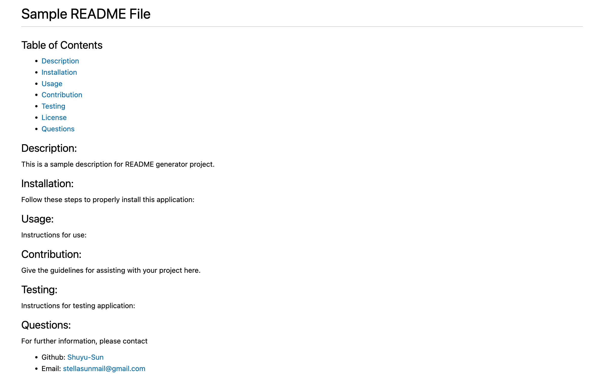
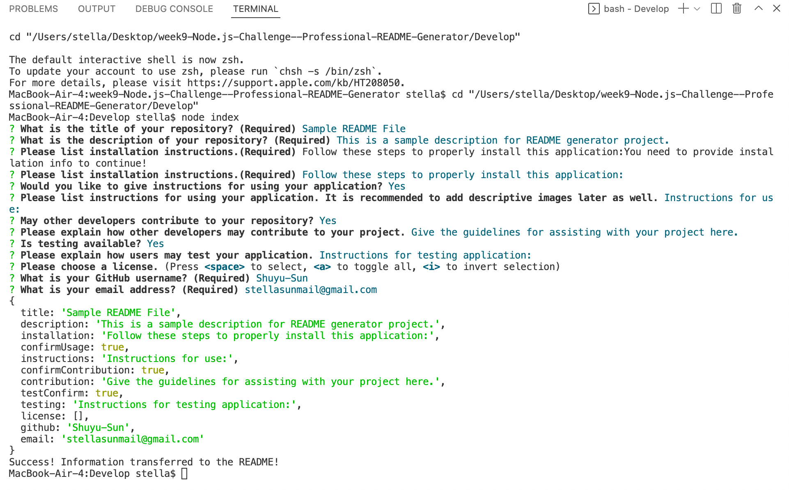

# week9-Node.js-Challenge--Professional-README-Generator

## Table of Contents 
  - [Description](#description)
  - [Installation](#installation)
  - [Usage](#usage)
  - [Contribution](#contribution)
  - [Testing](#testing)
  - [License](#license)
  - [Questions](#questions)

  ## Description:
  This is a command line interface application which creates a README file for your application repositories. 

  ## Installation:
  Follow these steps to properly install this application:
  To install this app you will need to run npm install for the following dependencies in your inquirer, fs, and util. This will allow the question prompts for you to create your README.md.

  ## Usage:
  Run the command node index.js. As you answer each question you dynamically form the sections, and table of contents for your README.
  All the responses are converted to markdown format and the fs.write package will create the README.md file automatically upon completing the prompts.

  ## Screenshot
  
  

  ### Repository link
  hhttps://github.com/Shuyu-Sun/week9-Node.js-Challenge--Professional-README-Generator

  ## Questions:
  For further information, please contact
  - Github: [Shuyu-Sun](https://github.com/Shuyu-Sun)
  - Email: stellasunmail@gmail.com 